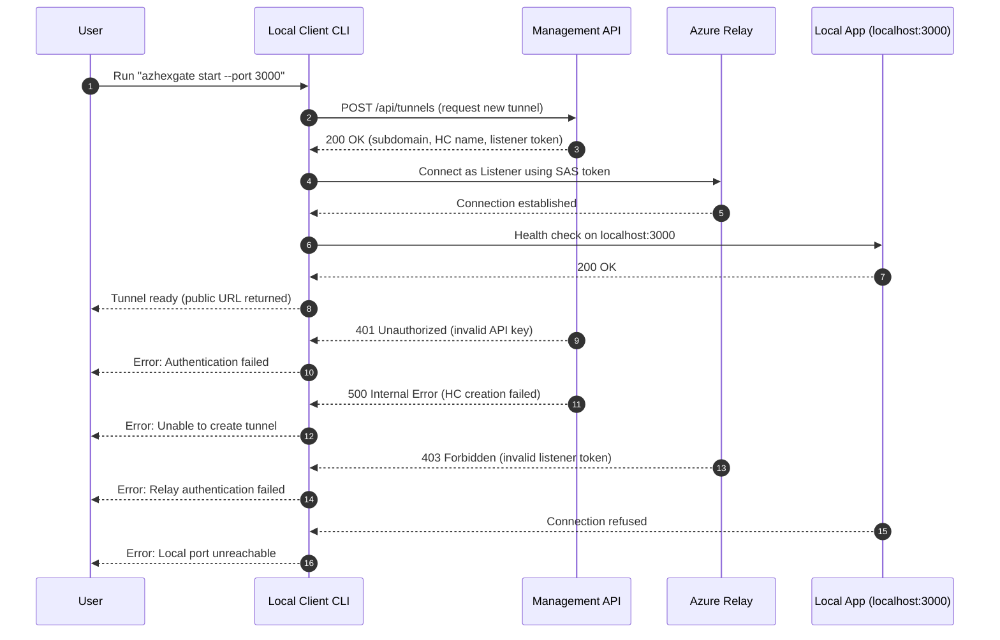
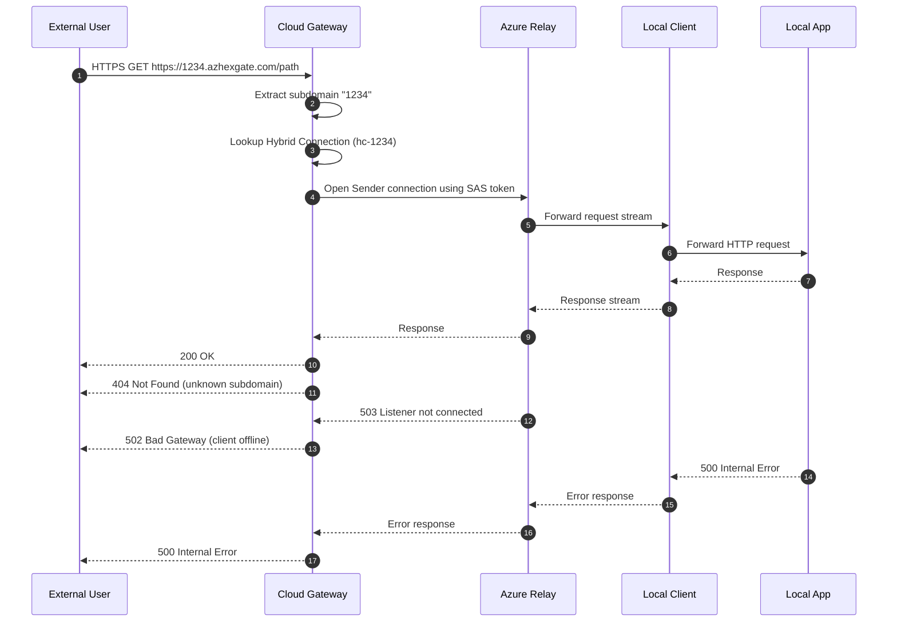
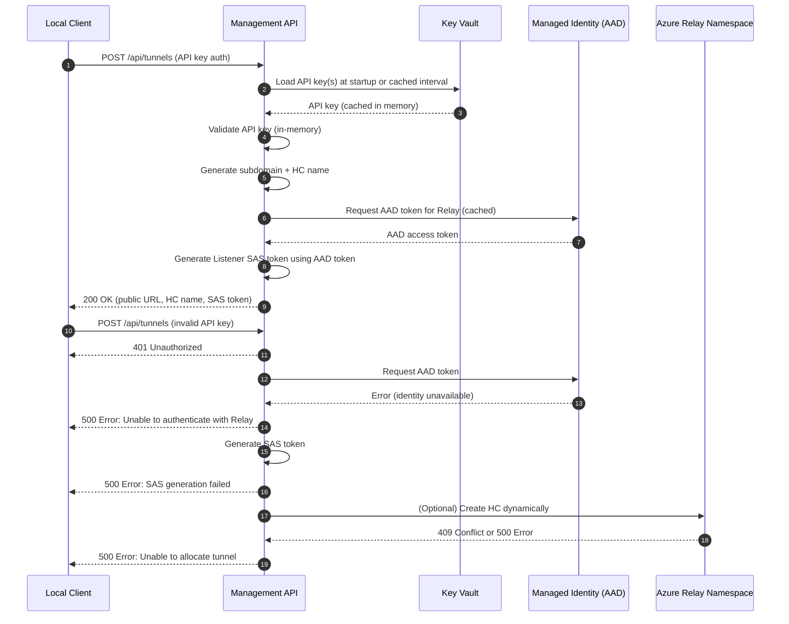
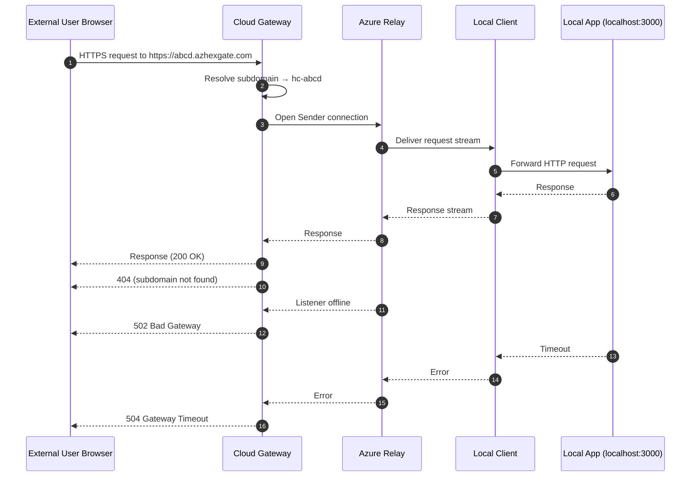

# AzHexGate Architecture

## 1. Overview

AzHexGate is a self‑hosted, Azure‑native reverse tunneling platform. Its purpose is to let a user expose a local application (for example `http://localhost:3000`) to the internet under a public, ephemeral URL like:

- `https://4736948379.azhexgate.com`

All traffic goes through infrastructure owned by the AzHexGate operator (your Azure subscription). There is no third‑party relay service: you control the public endpoint, the relay, the routing, and the security.

At a high level, AzHexGate is composed of:

- Local Client (Go CLI): runs on the user’s machine, connects outbound to Azure Relay, and forwards traffic between Relay and `localhost`.
- Cloud Gateway (Go web app): runs in Azure App Service, receives public HTTP(S)/WebSocket traffic and forwards it through Azure Relay.
- Management API (Go service, often co‑hosted with the gateway): handles tunnel provisioning, subdomain allocation, and handing out connection metadata to the client.
- Azure Infrastructure (Bicep): Relay, App Service, DNS, Key Vault, logging, identities, and networking.

The user experience goal: “run one CLI command, get a public URL, no Azure setup required.”

---

## 2. High‑level goals and design principles

### 2.1 Goals

- Full infrastructure ownership
  - All traffic goes through Azure resources in the operator’s subscription. No external SaaS relays.
- Zero friction for end users. Users should only:
  - install the CLI
  - run: `azhexgate start --port 3000`
  - get back a URL like `https://12345678.azhexgate.com`.
- Production‑grade security and reliability
  - No inbound ports on the user’s machine.
  - Encrypted tunnels end‑to‑end.
  - Principle of least privilege in Azure.
  - Logging/observability for debugging and auditing.
- Modular, testable design
  - Clear separation between client, gateway, management, and infra.
  - High unit and integration test coverage.
  - Infrastructure as code (Bicep) with CI validation.
- Incremental evolution
  - Start with API key auth, later add OIDC.
  - Start with simple HTTP tunneling, later extend to WebSockets / other protocols.

### 2.2 Non‑goals (for now)

- Massive multi‑tenant SaaS product.
- Non‑HTTP protocols (e.g. raw TCP) as first‑class citizens.
- Highly complex access control models (RBAC, multi‑user orgs, etc.) in v0.

---

## 3. Component architecture

### 3.1 Local Client (Go)

Purpose:

Runs on the user’s machine, establishes the reverse tunnel to Azure, and forwards traffic between the Relay and the local service (e.g. `localhost:3000`).

Responsibilities:

- CLI entrypoint (`azhexgate` binary), providing a command like: 
  - `azhexgate start --port 3000`
  - stop will be done by sending ctrl+c
- Contact the Management API to request a new tunnel:
  - Ask for a random subdomain (e.g. 63873749).
  - Get back:
    - assigned subdomain (`63873749.azhexgate.com`)
    - Hybrid Connection name
    - Azure Relay endpoint
    - Listener SAS token (or equivalent credentials)
    - any session identifier / metadata.
- Establish a Listener connection to the Azure Relay Hybrid Connection using the provided token.
- Maintain a persistent, outbound connection to Relay:
  - handle reconnection and backoff
  - handle graceful shutdown.
- Accept incoming tunnel streams from Relay:
  - forward them as HTTP requests to `localhost:<port>`
  - relay responses back to Relay for return to the caller.
- Log local events and, optionally, send telemetry signals (e.g., connection status) to the management backend.

Key design points:
- Runs entirely outbound (no firewall/NAT configuration needed).
- Treats the local service as a black box HTTP/WebSocket server.
- Should not require the user to know anything about Azure Relay.
- Should be able to run on any OS (Windows, Mac, Linux)



---

### 3.2 Cloud Gateway (Go, in App Service)

Purpose:

Public‑facing entrypoint for HTTP(S)/WebSocket traffic. It terminates TLS, checks authentication, routes per subdomain, and forwards requests into Azure Relay as the Sender.

Responsibilities:

- Bind to `*.azhexgate.com` via wildcard DNS and certificate.
- Receive incoming HTTPS requests at URLs such as:
  - `https://63873749.azhexgate.com/...`
- Inspect the `Host` header to determine which tunnel/subdomain is being addressed.
- Lookup the associated Relay Hybrid Connection for that subdomain:
  - E.g., `63873749` → Hybrid Connection `hc-63873749`.
- Generate or retrieve a Sender SAS token for the relevant Hybrid Connection.
- Open a stream to the Relay and forward the incoming HTTP/WebSocket request down that stream.
- Receive the response from the local client via Relay and write it back to the original caller.
- Enforce API key authentication (for management API calls, and optionally for certain protected endpoints).
- Expose the Management API endpoints (see next section).

Key design points:
- The gateway is involved in every single request, not just connection setup.
Relay is not public; the gateway is the public HTTP server.
- Can scale out using App Service scaling and optionally Azure Front Door if needed.
- Must be implemented in a streaming‑friendly way, avoiding buffering entire request/response bodies unnecessarily.



---

### 3.3 Management API (Go)

Purpose:

Provide a control plane for tunnels. The Local Client calls it to get everything it needs for a new tunnel without touching Azure directly.

Responsibilities:

- Provision a tunnel session:
  - Accept a request from the Local Client: `POST /api/tunnels` with parameters like:
    - requested local port (optional, mostly informational)
    - optional hint (name/tag)
  - Generate a random, unique subdomain ID (e.g., `63873749`).
  - Derive or create the matching Hybrid Connection name (e.g., `hc-63873749`).
    - In v1, these may be pre‑created or created via Azure management APIs.
  - Generate a Listener token scoped to that Hybrid Connection.
  - Return a JSON response with:
    - `public_url`: `https://63873749.azhexgate.com`
    - `relay_endpoint`
    - `hybrid_connection_name`
    - `listener_token`
    - optional `session_id`.
- Maintain tunnel metadata:
  - keep an in‑memory or persistent map of:
    - subdomain → hybrid connection
    - session state (active/inactive, last heartbeat)
  - support future features like listing or revoking tunnels.
- Enforce authentication:
  - secure management endpoints via API key (initially).
  - later support OIDC so only authorized users can create/manage tunnels.
- Policy enforcement:
  - limit number of simultaneous tunnels per user/account (future).
  - control TTL for ephemeral tunnels.

Deployment note:

The Management API can be co‑hosted with the Cloud Gateway in the same App Service to reuse infrastructure and keep architecture simple in the first version.



---

### 3.4 Azure Relay Hybrid Connections

Purpose:

Provide a secure, outbound‑only, bi‑directional tunnel between:
- Sender: Cloud Gateway in Azure
- Listener: Local Client on the user’s machine

Responsibilities:
- Act as the rendezvous point:-
  - both sides connect outbound to Relay
  - Relay matches them and creates a duplex stream.
- Carry HTTP/WebSocket traffic as raw streams.
- Enforce security via SAS tokens with specific rights:
  - Listen (for client)
  - Send (for gateway).
  - 
Key concepts:
- Namespace: e.g., `azhexgate-relay-<env>`
- Hybrid Connection: one per tunnel/subdomain (in the simplest model)
- SAS tokens:
  - generated by AzHexGate backend using the namespace keys
  - time‑limited, scoped to a specific Hybrid Connection.

---

### 3.5 Azure Infrastructure (Bicep)

Infrastructure is expressed entirely in Bicep and deployed via GitHub Actions.

Core resources:
- Azure Relay Namespace
  - hosts all Hybrid Connections for AzHexGate.
- Hybrid Connections
  - created programmatically or pre‑provisioned via Bicep.
- App Service (Linux)
  - runs the Cloud Gateway + Management API.
  - bound to a custom domain like `azhexgate.com`.
  - uses wildcard TLS certificate for `*.azhexgate.com`.
- Key Vault
  - stores:
    - API keys (for management)
    - TLS certificate secrets (optional, or use App Service cert features).
- Azure DNS
  - configured with a wildcard CNAME / A record for *.azhexgate.com to the App Service.
- Log Analytics + Application Insights (or similar)
  - telemetry, logs, metrics.
- Managed Identity
  - used by the gateway to access Key Vault, Relay, etc.

Infrastructure layers will be split into Bicep modules:
- `infra/main.bicep` – environment entrypoint.
- `infra/modules/relay.bicep` – Relay namespace + base settings.
- `infra/modules/appservice.bicep` – App Service, managed identity, settings.
- `infra/modules/observability.bicep` – logging, App Insights/Log Analytics.
- `infra/modules/security.bicep` – Key Vault, networking rules, identity bindings.

---

## 4. Request/response flow (end‑to‑end)

This is the core “how it works” scenario:



User has app at `http://localhost:3000` and runs:

`azhexgate start --port 3000`

### 4.1 Tunnel setup

1. CLI start

    The Local Client parses arguments and loads configuration (API key, AzHexGate base URL, etc.).

2. Management API call

    The client sends a request to the Management API, e.g.:
    - `POST https://api.azhexgate.com/api/tunnels`
    - Body: `{ "local_port": 3000 }`
    - Auth: API key in a header.

3. Management API provisions a tunnel session

    The backend:
    - generates a subdomain, say 63873749.
    - determines or creates hc-63873749 in the Relay namespace.
    - generates a Listener SAS token for hc-63873749.
    - possibly ensures any internal metadata is stored (subdomain → hybrid connection).
    - returns:
      ```json
      {
        "public_url": "https://63873749.azhexgate.com",
        "relay_endpoint": "<relay-namespace-url>",
        "hybrid_connection_name": "hc-63873749",
        "listener_token": "<token>",
        "session_id": "<id>"
      }
      ```

4. Client connects as Listener

    The Local Client uses `relay_endpoint`, `hybrid_connection_name`, and `listener_token` to initiate a Listener connection and waits for streams from Relay.

5. CLI output
  
      The CLI prints something like:
      ```
      Tunnel established
      Public URL: https://63873749.azhexgate.com
      Forwarding to: http://localhost:3000
      ```

### 4.2 Handling an external request

When someone hits `https://63873749.azhexgate.com`:

1. DNS & TLS

    DNS resolves `63873749.azhexgate.com` to the App Service. TLS terminates at the Cloud Gateway using the wildcard certificate.
2. Cloud Gateway receives request

    The gateway sees:
    - Host: `63873749.azhexgate.com`
    - Path: `/some/endpoint`

3. Routing and lookup

    Gateway extracts `63873749` as the tunnel ID and looks up its mapping:
    - `63873749` → `hc-63873749`.

4. Sender connection via Relay

    Gateway generates (or fetches) a Sender token scoped to `hc-63873749` and uses Relay SDK to open a stream to the Listener (Local Client).

5. Forwarding to local app

    The Local Client receives the stream from Relay and:
    - constructs an HTTP request towards `http://localhost:3000`
    - replicates method, path, headers, and body
    - sends it to the local app
    - collects the response.

6. Response back to caller

    Response travels back in reverse:
    - Local app → Local Client → Relay → Cloud Gateway → External caller.

From the local app’s perspective, it is just serving traffic on `localhost:3000`.

---

## 5. Authentication and security

### 5.1 Current auth model (v0)

- User → Management API  
  Auth via API key (e.g., header `X-AzHexGate-ApiKey`).  
  API keys are stored securely in Key Vault and loaded at startup or on a refresh interval.

- Cloud Gateway → Azure Relay  
  Auth via Azure AD using the App Service’s Managed Identity.  
  The Gateway obtains an AAD access token, caches it in memory, and refreshes it proactively before expiry or reactively on authentication errors.  
  No Relay keys are required for the Gateway, and no Key Vault calls occur in the hot path.

- Management API → Azure Relay  
  Used only to generate short‑lived SAS Listener tokens for Local Clients.  
  Preferably uses Managed Identity to request Relay access; optionally may use a single Relay Shared Access Key stored in Key Vault and cached in memory.

- Local Client → Azure Relay  
  Auth via a short‑lived Listener SAS token issued by the Management API.  
  The Local Client never sees Relay keys and never interacts with Key Vault.

Security principles:
- No secrets in source code or configuration files.
- API keys stored in Key Vault; Relay keys stored only if Managed Identity cannot be used for SAS generation.
- SAS tokens are time‑limited and scoped to a single Hybrid Connection.
- Cloud Gateway uses Managed Identity with in‑memory token caching and automatic refresh.
- No inbound ports on the user’s machine; all connections are outbound.
- Key Vault is never queried per request; all secrets are cached and refreshed safely.

### 5.2 Future OIDC model (v1+)

- Add OIDC (e.g., Azure AD) for:
  - authenticating users to the Management API.
  - associating tunnels with user accounts.
- Optionally keep API keys for automation / CI usage.

---

## 6. Scalability and performance considerations

### 6.1 Cloud Gateway as a bottleneck

- All public traffic flows through the Cloud Gateway.
- Gateway scalability is crucial:
  - vertical and horizontal scaling in App Service.
  - potential use of Azure Front Door as a global entrypoint.
- Gateway must use efficient streaming; avoid buffering entire bodies.


### 6.2 Multiple clients and tunnels

- Each tunnel is uniquely identified by its subdomain ID.
- Mapping: `subdomain` → `Hybrid Connection name`.
- Multiple clients can run simultaneously; they each connect as Listeners to their own Hybrid Connection(s).
- Gateway maintains a routing table/cache for subdomains.


### 6.3 Resource management

- Keep per‑tunnel Hybrid Connections limited; consider reuse strategies later.
- Implement TTL/cleanup for idle tunnels (future).

---

## 7. Public vs Management Endpoints & Access Restrictions

### 7.1 Overview

AzHexGate exposes two distinct categories of HTTP endpoints through the Cloud Gateway:

1. **Public Tunnel Endpoints**  
   These endpoints must be reachable from anywhere on the internet because they serve as the public entrypoint for tunnel traffic.  
   Example:  
   ```
   https://<subdomain>.azhexgate.com/*
   ```

2. **Management API Endpoints**  
   These endpoints are used by the Local Client to request new tunnels, obtain credentials, and manage sessions. They should **not** be publicly accessible to the entire internet.  
   Example:  
   ```
   https://api.azhexgate.com/api/tunnels
   ```

By splitting the public tunnel endpoint from the Management API and applying strict access restrictions, AzHexGate achieves:

- A **globally reachable** tunnel entrypoint  
- A **locked‑down control plane**  
- Reduced attack surface  
- Clear separation of responsibilities  
- Compatibility with future OIDC authentication and multi‑tenant models  

This design ensures that only trusted clients can create tunnels, while end users anywhere in the world can access the public URLs generated by AzHexGate.

### 7.2 Public Tunnel Endpoint

#### Purpose
The public endpoint handles all incoming traffic destined for a user’s local application. It must remain accessible from any IP address because tunnel consumers may be located anywhere.

#### Characteristics
- Hosted on the Cloud Gateway App Service.  
- Uses wildcard domain: `*.azhexgate.com`.  
- TLS termination via wildcard certificate.  
- No IP restrictions applied (global access required).  
- Routes traffic based on the `Host` header to the correct Hybrid Connection.

#### **Security Considerations**
- Only the **tunnel forwarding path** is exposed publicly.  
- No management or administrative operations are available on this endpoint.  
- All forwarded traffic is authenticated implicitly through the Relay Listener/Sender token model.

### 7.3 Management API Endpoint

#### Purpose
The Management API is responsible for provisioning tunnels, generating subdomains, issuing Relay Listener tokens, and returning configuration metadata to the Local Client.

Because this API controls the creation of tunnels, it must be protected from broad public access.

#### Characteristics
- Exposed under a dedicated path or hostname (e.g., `api.azhexgate.com`).  
- Requires API key authentication (OIDC in future versions).  
- Only accessed by the Local Client or trusted operators.

### 7.4 Access Restriction Rules (App Service)

Azure App Service does not support NSGs directly, but it provides **Access Restrictions**, which act as a built‑in firewall at the platform edge.

These rules allow AzHexGate to tightly control who can call the Management API.

#### Recommended Rules

##### Management API
- **Allow**: Operator IP ranges (e.g., your home IP, corporate VPN, CI/CD agents).  
- **Allow**: Optional Azure Front Door IPs if using Front Door as a secure entrypoint.  
- **Deny**: All other IPs.

Example rule set:
```
Allow  24.48.0.0/16        # Operator IP range
Allow  10.0.0.0/8          # Corporate VPN
Allow  AzureFrontDoor      # If using AFD
Deny   All
```

##### Public Tunnel Endpoint
- **Allow**: All (global access required).  
- **Deny**: None (except optional WAF/Front Door filtering).

#### Implementation Notes
- Access Restrictions are evaluated **before** the request reaches your application code.  
- Rules can be applied per‑path or per‑hostname if the gateway is configured to split endpoints internally.  
- If using a single App Service for both public and management endpoints, the gateway must route requests internally so that restrictions apply only to management paths.

### 7.5 Optional/Later: Azure Front Door Integration

For enhanced security and global performance, Azure Front Door can be placed in front of the Cloud Gateway.

Benefits:
- WAF (Web Application Firewall)  
- IP filtering  
- Bot protection  
- Rate limiting  
- Global caching (not used for tunnels, but useful for static assets)  
- Ability to restrict App Service to accept traffic **only from Front Door**

If Front Door is used:
- App Service Access Restrictions should allow only Front Door’s IP ranges.  
- Management API can still apply additional IP filtering at the Front Door level.

---

## 8. Repository layout and contribution guidance

### 8.1 Planned layout

At maturity, the repository will roughly follow:
```
.
├── cmd/
│   ├── azhexgate/          # CLI entrypoint for local client
│   │   ├── main.go         # Minimal entry point (calls cmd.Execute())
│   │   └── cmd/            # Cobra command definitions
│   │       ├── root.go     # Root command
│   │       └── start.go    # Start subcommand
│   └── gateway/            # Entry for cloud gateway/management API
│       ├── main.go         # Minimal entry point (calls cmd.Execute())
│       └── cmd/            # Cobra command definitions
│           └── root.go     # Root command
├── client/                 # Local client implementation
│   ├── tunnel/             # Relay listener, forwarding
│   ├── config/             # Config parsing, env handling
│   └── auth/               # Client-side auth helpers (API key handling)
├── gateway/
│   ├── http/               # HTTP server, routing, middleware
│   ├── relay/              # Sender integration with Azure Relay
│   ├── management/         # Management API handlers & logic
│   └── routing/            # Subdomain → tunnel resolution
├── internal/               # Shared libraries used by both client & gateway
│   ├── logging/
│   ├── telemetry/
│   ├── azure/
│   └── util/
├── infra/
│   ├── main.bicep
│   └── modules/
│       ├── relay.bicep
│       ├── appservice.bicep
│       ├── kv.bicep
│       ├── dns.bicep
│       └── observability.bicep
├── .github/
│   ├── workflows/
│   │   ├── ci.yml
│   │   └── infra.yml
│   └── copilot-instructions.md
├── README.md
└── docs/
    ├── architecture.md      # this file
    └── design-decisions.md
```

#### 8.1.1 CLI Structure

Both `azhexgate` and `gateway` use the [Cobra](https://github.com/spf13/cobra) library for CLI command structure:

- `main.go`: Minimal entry point that calls `cmd.Execute()`
- `cmd/root.go`: Defines the root command with common flags and configuration
- `cmd/<subcommand>.go`: One file per subcommand (e.g., `start.go`, `serve.go`)

This structure provides:
- Consistent command-line interface patterns
- Automatic help generation
- Shell completion support
- Easy extensibility for new commands

### 8.2 What contributors should know

- Client changes: usually live under `client/` and `cmd/azhexgate/`.
- Gateway or management changes: usually live under `gateway/` and `cmd/gateway/`.
- Infra changes: live under `infra/` and must be validated via Bicep build and GitHub Actions.
- Shared logic: should go into `internal/` where it can be reused safely.

Before merging:

- Ensure Unit tests passes.
- Ensure binaries compiles.
- Ensure Bicep templates build.
- Ensure CI workflows remain green.
- Ensure documentaions are properly updated if needed.

---

## 9. Future extensions

Planned or potential future features:

- OIDC authentication and user accounts.
- Configurable custom domains per tunnel (not just *.azhexgate.com).
- Persistent tunnel configuration (reconnect with same subdomain).
- Web UI for managing tunnels.
- Rate limiting and QoS controls + Front Door integration
- Additional protocol support beyond HTTP.

---


Keyvault not used to save/fetch relay key, can we use maanged identity and cache it in memory with some routine that check if the key has bee rotated or when there is a error reachig out to relay ?